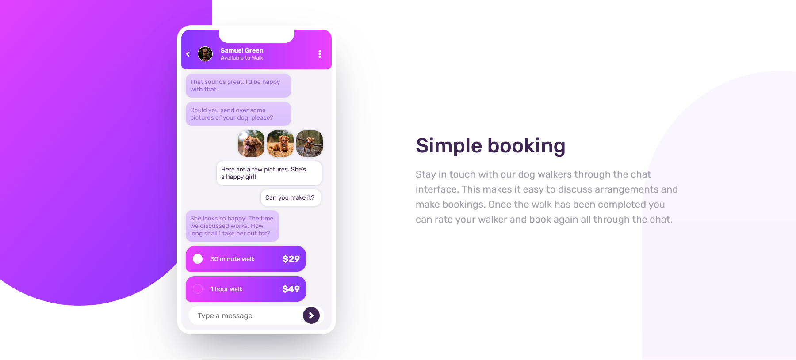

# Frontend Mentor - chat-app-css-illustration

This is a solution for the [Chat app CSS illustration challenge hub](https://www.frontendmentor.io/challenges/nft-preview-card-component-SbdUL_w0U).

## Table of contents

- [Overview](#overview)
  - [The challenge](#the-challenge)
  - [Screenshots](#screenshots)
  - [Demo links](#links)
- [Techniques](#my-process)
  - [Built with](#built-with)
- [Author](#author)

## Overview

### The challenge

The user should be able to:

- View the layout depending on their device's screen size.

### Screenshots

### Links

- Solution URL: [Github solution URL](https://github.com/MohamedAldawi/NFT-preview-card-component)
- Live demo URL: [Netlify URL](https://aldawi-web-frontend-mentor-card.netlify.app/)

## My process

### Built with

- Semantic HTML5 markup
- Sass preprocessor to generate CSS
- Flexbox System
- Grid System
- Mobile-first workflow

### Useful resources

- [W3 schools](https://www.w3schools.com/) - I'd recommend it to anyone still learning this concept.

## Author

- Frontend Mentor - [Mohamed Aldawi](https://aldawi-web-frontend-mentor-card.netlify.app/)
